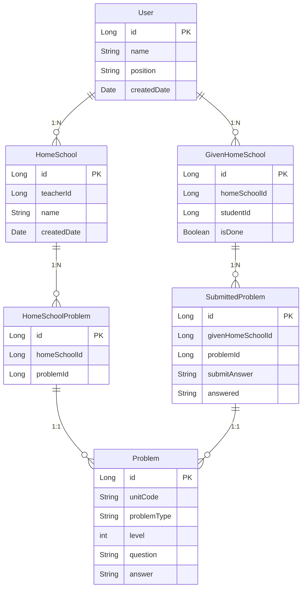

## ERD 설명
### Problem 테이블
* 설명: 문제 정보가 저장된 테이블
* 주요 컬럼
    * unitCode: 문제 유형 코드
    * problemType: 주관식, 객관식, 전체 3가지 유형 정보
    * level: 난이도
        * 난이도 하 - 1
        * 난이도 중 - 2, 3, 4
        * 난이도 상 - 5
    * question: 문제 내용
    * answer: 정답

### HomeSchool 테이블
* 설명: 학습지 정보가 저장된 테이블
* 주요 컬럼
    * teacherId: 학습지를 만든 선생님 ID
    * name: 학습지 이름

### HomeSchoolProblem 테이블
* 설명: 학습지에 출제한 문제 정보가 저장된 테이블
* 주요 컬럼
    * homeSchoolId: 문제가 출제된 학습지 ID
    * problemId: 문제 ID

### GivenHomeSchool 테이블
* 설명: 학생에게 출제한 학습지 정보가 저장되는 테이블
* 주요 컬럼
    * homeSchoolId: 출제된 학습지 ID
    * studentId: 학생 유저 ID
    * isDone: 학생이 해당 학습지에 대해 채점까지 완료했는지 상태 정보

### SubmittedProblem 테이블
* 설명: 학생이 제출한 학습지의 문제 별 정답
* 주요 컬럼
    * givenHomeSchoolId: 학생에게 출제된 학습지 ID
    * problemId: 문제 ID
    * submitAnswer: 학생이 제출한 정답
    * answered: 정답을 맞췄는지 틀렸는지 정보 (채점 후 업데이트)

### User 테이블
* 설명: 사용자 (선생님, 학생)에 대한 정보가 저장되는 테이블
* 주요 컬럼
    * name: 사용자 이름
    * position: 직책 (선생님, 학생)
